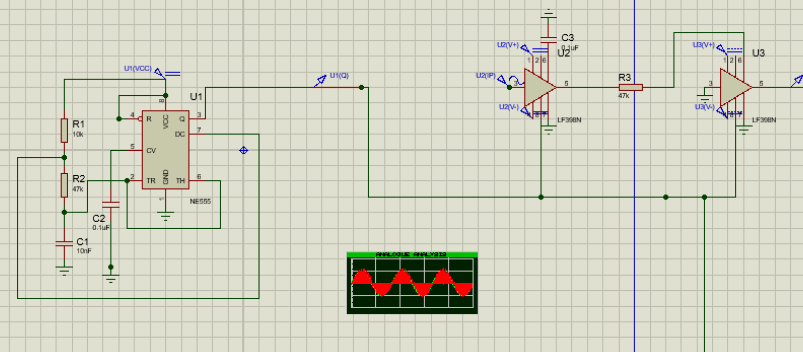
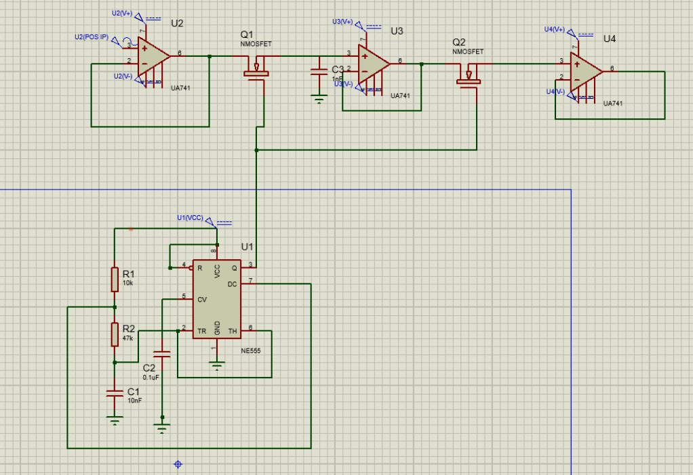
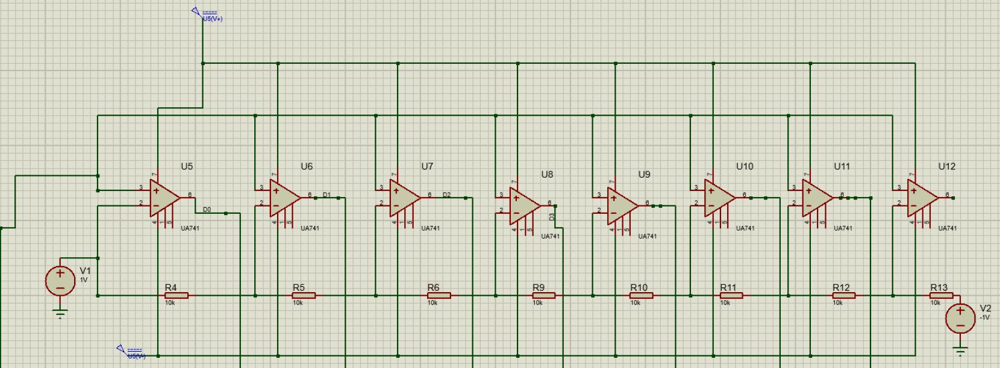
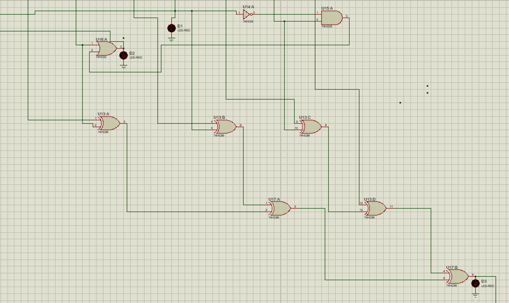
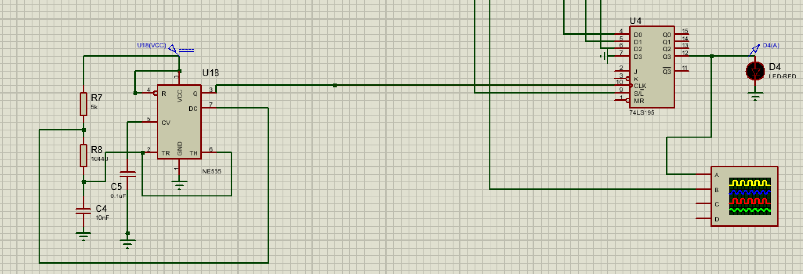
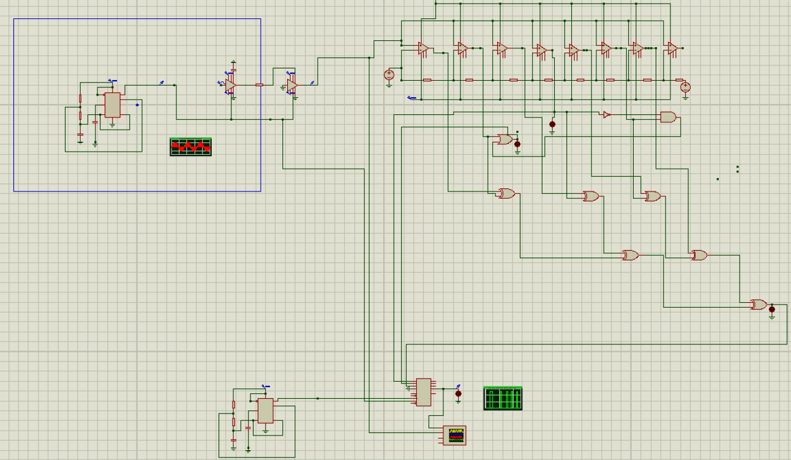

# Pulse Code Modulation (PCM)

**Course:** EEE 310 - Communications Laboratory  
**Domains:** Digital Communications, Signal Processing, Hardware Design  

## Project Overview
This project explores the implementation of Pulse Code Modulation (PCM), a fundamental technique for digitally representing sampled analog signals. By performing sampling, quantization, and encoding, the system transforms continuous-time signals into a digital stream suitable for high-fidelity communication over digital channels.

## System Architecture & Methodology
The PCM process is divided into three critical stages, each implemented using dedicated hardware circuits.

### 1. Sampling Stage
The sampling stage converts the continuous analog input into a discrete-time signal using sample-and-hold circuitry.

| Sample & Hold (LF398N) | Sampling (NMOS) |
| :---: | :---: |
|  |  |

### 2. Quantization Stage
The quantization stage maps the sampled values into a finite set of discrete levels using a 3-bit quantizer to maintain signal integrity.

  
*Figure: 3-bit Quantizer circuitry used to convert sampled levels into discrete binary values.*

### 3. Encoding Stage
The encoding stage converts the quantized levels into a digital binary stream using a priority encoder and parallel access shift registers for serial transmission.

| Priority Encoder | Shift Register |
| :---: | :---: |
|  |  |

## Full Hardware Implementation
The complete system combines these stages to demonstrate the full PCM transmitter chain on a breadboard setup.

  
*Figure: Complete schematic diagram of the PCM transmitter chain.*

  
*Figure: Final hardware prototype showcasing the integrated PCM components.*
